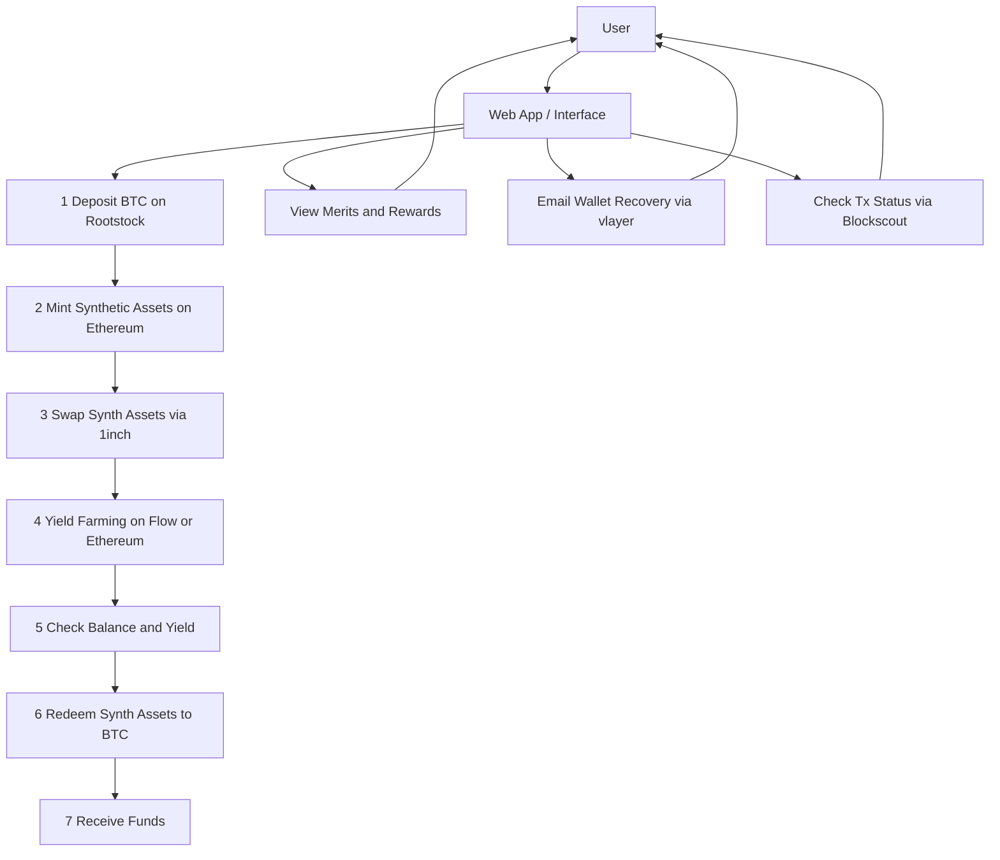
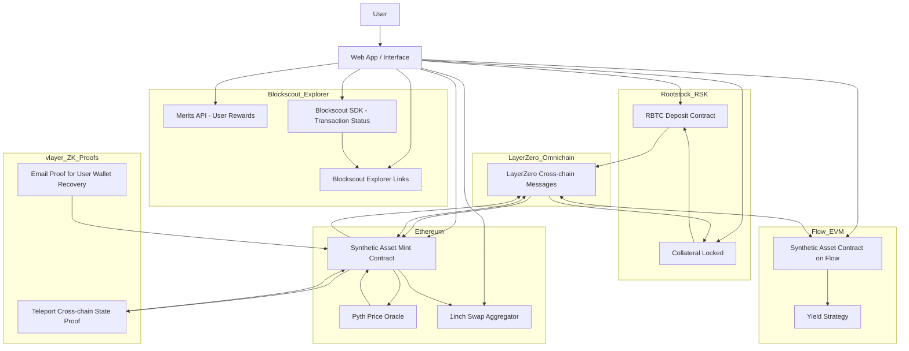

# OmniSynth

OmniSynth lets you lock up one cryptocurrency to create another that you can trade or use to earn rewards across different networks. When you’re ready, you exchange the synthetic token back and get your original crypto back. Everything happens in one easy-to-use interface, making it simple to move assets and earn returns.

---

The diagrams below illustrate:

1. **High-level system architecture** (how contracts and services interact on Rootstock, Ethereum, Flow, LayerZero, etc.).
2. **User interaction flow** (step-by-step journey from depositing BTC to redeeming back).
3. **Detailed component architecture** (frontend, off-chain services, on-chain contracts, and cross-chain channels).

## Table of Contents

- [Overview](#overview)  
- [1. User Interaction Flow Diagram](#1-user-interaction-flow-diagram)
- [2. System Architecture Diagram](#2-system-architecture-diagram)  
  

---

## Overview

This project implements a synthetic-asset protocol spanning multiple chains:

- **Rootstock (RSK)** — Users deposit RBTC (Rootstock’s native coin) into a collateral contract.  
- **LayerZero** — Facilitates cross-chain messaging between Rootstock, Ethereum, and Flow.  
- **Ethereum** — Mints a synthetic ERC-20 token (e.g., sUSDT) based on Pyth oracle pricing; users can swap on 1inch.  
- **Flow (EVM-compatible)** — A mirrored synthetic contract receives cross-chain tokens and routes them into yield strategies.  
- **Blockscout** — Provides SDK methods, Merits API for user rewards, and explorer links.  
- **vlayer** — Supplies teleport proofs (cross-chain state) and email proofs for wallet recovery.  

Below are Mermaid diagrams that illustrate the different perspectives of this protocol.

---

## 1. User Interaction Flow Diagram

# Description

## Web App / Interface
- The central React.js UI where users perform all actions.

## Step 1 – Deposit BTC on Rootstock
- User initiates a deposit of RBTC into the RBTC Deposit Contract on Rootstock.
- Once confirmed, LayerZero relays the deposit event to Ethereum.

## Step 2 – Mint Synthetic Assets on Ethereum
- On receiving the LayerZero message, the Synthetic Mint Contract mints an equivalent amount of sUSD (or similar) based on price from Pyth Oracle.

## Step 3 – Swap Synthetic Assets via 1inch
- User can optionally swap minted sUSD for other tokens on Ethereum using the 1inch Swap Aggregator.

## Step 4 – Yield Farming on Flow or Ethereum
- User transfers sUSD to Flow via LayerZero (Flow Synth Contract) or stays on Ethereum.
- On Flow, the Flow Synthetic Contract deposits tokens into a yield strategy.

## Step 5 – Check Balance and Yield
- UI shows real-time balances and yield earned; data comes from on-chain queries to Flow or Ethereum.

## Step 6 – Redeem Synthetic Assets to BTC
- When the user chooses to exit, they burn sUSD on Ethereum.
- A cross-chain message is sent via LayerZero to the Rootstock Collateral Locked contract to unlock RBTC.

## Step 7 – Receive Funds
- RBTC is returned to the user’s Rootstock wallet.

---

## Optional UI Actions
- **View Merits and Rewards**: Queries Merits API to show the user’s earned points.
- **Email Wallet Recovery**: Initiates vlayer’s email-proof workflow for regaining access.
- **Check Tx Status**: Uses Blockscout SDK to fetch and display transaction statuses.

## 2. System Architecture Diagram

## System Architecture Diagram Description

This diagram illustrates the core components and interactions in the OmniSynth platform:

1. **Rootstock (RSK)**
   - **RBTC Deposit Contract (`Deposit`)**  
     Users send RBTC to this contract, which locks their collateral.
   - **Collateral Locked (`Collateral`)**  
     Represents the on-chain state holding user RBTC until redemption.

2. **Ethereum**
   - **Synthetic Asset Mint Contract (`SynthMint`)**  
     Mints synthetic tokens (e.g., sUSD) when it receives a cross-chain deposit message from Rootstock.
   - **Pyth Price Oracle (`PriceOracle`)**  
     Supplies real-time price feeds to the mint contract, ensuring correct mint ratios.
   - **1inch Swap Aggregator (`OneInchSwap`)**  
     Allows users to swap minted synthetic tokens for other assets on Ethereum.

3. **Flow (EVM)**
   - **Synthetic Asset Contract on Flow (`FlowSynth`)**  
     Receives synthetic tokens from Ethereum via LayerZero messaging.
   - **Yield Strategy (`YieldStrategy`)**  
     Holds synthetic tokens on Flow to generate yield through various farming protocols.

4. **LayerZero (Omnichain)**
   - **LayerZero Cross-chain Messages (`LayerZeroMessaging`)**  
     Trusted messaging layer that relays deposit and redemption events between Rootstock, Ethereum, and Flow.

5. **Blockscout Explorer**
   - **Merits API (`MeritsAPI`)**  
     Tracks user interactions (mint, swap, yield, redeem) and awards points for engagement.
   - **Blockscout SDK (`SDK`)**  
     Lets the frontend query transaction statuses and related metadata in real time.
   - **Explorer Links (`Explorer`)**  
     Provides direct links to Blockscout pages for transactions and contract state.

6. **vlayer (ZK Proofs)**
   - **Teleport (`Teleport`)**  
     Generates zero-knowledge proofs to verify Flow balances on Ethereum without trust.
   - **Email Proof (`EmailProof`)**  
     Creates ZK proofs for email-based wallet recovery, enhancing user security.

7. **Web App / Interface (`UI`)**
   - Acts as the central React.js frontend for all user interactions.
   - **UI ↔ Smart Contracts**  
     - Initiates deposits to `Deposit` on Rootstock.  
     - Calls mint functions on `SynthMint` on Ethereum.  
     - Triggers swaps on `OneInchSwap`.  
     - Bridges tokens to `FlowSynth` on Flow.  
     - Starts redemption by interacting with `Collateral` on Rootstock.
   - **UI ↔ Blockscout Services**  
     - Queries `SDK` for live transaction status.  
     - Retrieves user rewards via `MeritsAPI`.  
     - Provides `Explorer` links for transparency.

8. **Flow of Funds & Messages**
   - **Deposit → Mint**  
     1. User deposits RBTC into `Deposit`.  
     2. `Deposit` emits an event relayed via `LayerZeroMessaging` to `SynthMint`.  
     3. `SynthMint` fetches price from `PriceOracle` and mints synthetic tokens.
   - **Mint → Swap**  
     - User can swap minted tokens through `OneInchSwap`.
   - **Mint ↔ Flow**  
     - `SynthMint` and `FlowSynth` exchange tokens via `LayerZeroMessaging`.
     - Once on Flow, tokens enter `YieldStrategy` to generate returns.
   - **Redeem Flow → Rootstock**  
     - User burns synthetic tokens on Ethereum via `SynthMint`.  
     - `SynthMint` sends a redemption message through `LayerZeroMessaging` to `Collateral`.  
     - `Collateral` unlocks RBTC and returns it to `Deposit`.

9. **Proof & Security Layers**
   - **Teleport**  
     - Ensures Ethereum can verify Flow balances (cross-chain state) via ZK proofs.  
   - **EmailProof**  
     - Allows secure wallet recovery without exposing private keys.

10. **User Experience**
    - Through a single, intuitive web interface (`UI`), users can:
      - Deposit RBTC and mint synthetic tokens.
      - Swap tokens on Ethereum.
      - Bridge tokens to Flow for yield farming.
      - Redeem tokens back to RBTC.
      - Monitor transaction status via Blockscout SDK.
      - View earned Merits and rewards.
      - Recover wallet access via vlayer email proofs.

Together, these components enable a seamless, trust-minimized omni-chain synthetic asset experience for users.

